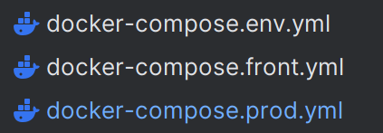
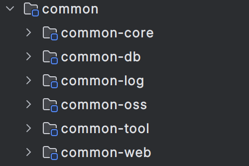
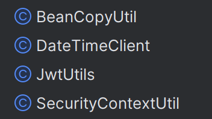

# 心流社区：基于SpringCloud+Vue3的微服务论坛社区项目

# 学习目标

- [x] 课程导学

- [x] 搭建项目架构，导入依赖，搭建公共模块

- [ ] 依据SpringSecurity和Gateway搭建网关和认证服务
- [ ] 实现客户端登录功能
- [ ] 实现客户端注册功能
- [ ] 搭建文章服务，实现基本的文章列表查询功能
- [ ] 实现文章详情查看，文章的新增
- [ ] 实现文章的浏览量初始化以及定时递增
- [ ] 实现文章分类功能
- [ ] 实现评论查看功能
- [ ] 实现新增评论功能
- [ ] DockerFile+docker-compose部署上线

# 课程导学

项目效果：www.xinliusq.xyz (已部署上线)

课程内容：从搭建项目到部署上线，从数据库到后端，前端，我都会带大家手写的，至少能够保证你能够写出和我一样的项目

业务内容：使用微服务架构，实现一个允许多个用户发布文章的论坛社区，该社区支持评论功能和浏览量统计功能，并且可以对文章进行分类展示

技术栈：

1. SpringBoot3
2. SpringCloud：Nacos+gateway+SpringSecurity(服务发现中心，配置中心，系统的授权认证)
3. Redis+SpringData（非关系型缓存中间件）
4. SpringAmqp+RabbitMq(消息队列中间件)
5. SpringMail（邮件发送）
6. Vue3+axios+elementPlus
7. DockerFile+docker-compose容器化部署
8. nginx反向代理

适用人群：

1. 暑假想卷项目的
2. 想找项目练习的
3. 找实习的
4. 做毕设，课设的
5. 投简历的

# 搭建项目架构

前端：

1. vue-client：用户端，采用响应式布局，可以确保网站在pc端和移动端的显示效果
2. vue-admin：管理系统，包括对用户账号的管理，审核文章等功能

后端：

1. 父工程管理依赖版本，以及用于指明环境部署的docker-compose文件

2. common：将一些公共类抽离，构成一个common模块，并且还要进一步细分

3. gateway-service：网关服务，实现认证，授权功能，跨域问题解决

父工程管理依赖版本：

版本属性：

```xml
<properties>
        <spring-boot.version>3.2.4</spring-boot.version>
        <spring-cloud.version>2023.0.1</spring-cloud.version>
        <spring-cloud-alibaba.version>2023.0.1.0</spring-cloud-alibaba.version>
        
    	<lombok.version>1.18.32</lombok.version>
        <slf4j.version>2.0.13</slf4j.version>
        <mybatis.version>3.5.5</mybatis.version>
        <hutool.version>5.8.27</hutool.version>
        <mysql.version>8.3.0</mysql.version>
        <alipay.version>2.2.3</alipay.version>
        <wxpay.version>0.4.9</wxpay.version>
        <commons-pool2.version>2.12.0</commons-pool2.version>
        <minio.version>8.5.10</minio.version>
        <codec.version>1.17.0</codec.version>
        <tx-oss.version>5.6.213</tx-oss.version>

        <maven.compiler.source>21</maven.compiler.source>
        <maven.compiler.target>21</maven.compiler.target>
        <project.build.sourceEncoding>UTF-8</project.build.sourceEncoding>
    </properties>
```

注意：

springboot，spring-cloud，spring-cloud-alibaba三者的版本一定要匹配，否则会因为缺少某些依赖或者部分依赖版本冲突，导致项目报错

```xml
<dependencyManagement>
        <dependencies>
            <dependency>
                <groupId>org.springframework.boot</groupId>
                <artifactId>spring-boot-dependencies</artifactId>
                <version>${spring-boot.version}</version>
                <type>pom</type>
                <scope>import</scope>
            </dependency>

            <dependency>
                <groupId>org.springframework.cloud</groupId>
                <artifactId>spring-cloud-dependencies</artifactId>
                <version>${spring-cloud.version}</version>
                <type>pom</type>
                <scope>import</scope>
            </dependency>
            <dependency>
                <groupId>com.alibaba.cloud</groupId>
                <artifactId>spring-cloud-alibaba-dependencies</artifactId>
                <version>${spring-cloud-alibaba.version}</version>
                <type>pom</type>
                <scope>import</scope>
            </dependency>

            <!-- https://mvnrepository.com/artifact/org.projectlombok/lombok -->
            <dependency>
                <groupId>org.projectlombok</groupId>
                <artifactId>lombok</artifactId>
                <version>${lombok.version}</version>
            </dependency>

            <!-- https://mvnrepository.com/artifact/org.slf4j/slf4j-api -->
            <dependency>
                <groupId>org.slf4j</groupId>
                <artifactId>slf4j-api</artifactId>
                <version>${slf4j.version}</version>
            </dependency>

            <dependency>
                <groupId>com.baomidou</groupId>
                <artifactId>mybatis-plus-spring-boot3-starter</artifactId>
                <version>${mybatis.version}</version>
            </dependency>

            <!-- https://mvnrepository.com/artifact/cn.hutool/hutool-all -->
            <dependency>
                <groupId>cn.hutool</groupId>
                <artifactId>hutool-all</artifactId>
                <version>${hutool.version}</version>
            </dependency>

            <dependency>
                <groupId>com.mysql</groupId>
                <artifactId>mysql-connector-j</artifactId>
                <version>${mysql.version}</version>
            </dependency>

            <!-- https://mvnrepository.com/artifact/com.alipay.sdk/alipay-easysdk -->
            <dependency>
                <groupId>com.alipay.sdk</groupId>
                <artifactId>alipay-easysdk</artifactId>
                <version>${alipay.version}</version>
            </dependency>

            <dependency>
                <groupId>com.github.wechatpay-apiv3</groupId>
                <artifactId>wechatpay-apache-httpclient</artifactId>
                <version>${wxpay.version}</version>
            </dependency>

            <!-- Sa-Token 权限认证（Reactor响应式集成）, 在线文档：https://sa-token.cc -->
            <dependency>
                <groupId>cn.dev33</groupId>
                <artifactId>sa-token-reactor-spring-boot3-starter</artifactId>
                <version>${sa-token.version}</version>
            </dependency>

            <dependency>
                <groupId>org.apache.commons</groupId>
                <artifactId>commons-pool2</artifactId>
                <version>${commons-pool2.version}</version>
            </dependency>

            <dependency>
                <groupId>io.minio</groupId>
                <artifactId>minio</artifactId>
                <version>${minio.version}</version>
            </dependency>

            <!-- https://mvnrepository.com/artifact/commons-codec/commons-codec -->
            <dependency>
                <groupId>commons-codec</groupId>
                <artifactId>commons-codec</artifactId>
                <version>${codec.version}</version>
            </dependency>

            <dependency>
                <groupId>com.qcloud</groupId>
                <artifactId>cos_api</artifactId>
                <version>${tx-oss.version}</version>
            </dependency>


        </dependencies>
    </dependencyManagement>
```

注意：以下依赖属于依赖版本的集合，即指定了一批依赖的版本

```xml
  			<dependency>
                <groupId>org.springframework.boot</groupId>
                <artifactId>spring-boot-dependencies</artifactId>
                <version>${spring-boot.version}</version>
                <type>pom</type>
                <scope>import</scope>
            </dependency>

            <dependency>
                <groupId>org.springframework.cloud</groupId>
                <artifactId>spring-cloud-dependencies</artifactId>
                <version>${spring-cloud.version}</version>
                <type>pom</type>
                <scope>import</scope>
            </dependency>
            <dependency>
                <groupId>com.alibaba.cloud</groupId>
                <artifactId>spring-cloud-alibaba-dependencies</artifactId>
                <version>${spring-cloud-alibaba.version}</version>
                <type>pom</type>
                <scope>import</scope>
            </dependency>
```

最后，必须要指定打包插件，并且在每一个需要打成jar包的微服务都引入该插件，否则，打出的jar包将不包括依赖类

```xml
<build>
        <pluginManagement>
            <plugins>
                <plugin>
                    <groupId>org.springframework.boot</groupId>
                    <artifactId>spring-boot-maven-plugin</artifactId>
                </plugin>
            </plugins>
        </pluginManagement>
    </build>
```

由于最终部署需要用到docker-compose文件，并且docker-compose文件一般较为冗长，所以，我建议一边写项目一边把部署的工作做好



我这里将不同作用的微服务，分到不同的文件中，到时候部署的时候也是先后部署，避免了启动顺序不同导致的错误的发生

作用如下：

1. docker-compose.env：包括了nacos，mysql，redis等有关环境的服务
2. docker-compose.prod：包括了本项目中手写的各个微服务
3. docker-compose.front：用于前端页面部署到nginx上

```yaml
version: '3'
services:
  mysql:
    image: mysql:8.0.18
    container_name: mysql8
    environment:
      - MYSQL_ROOT_PASSWORD=2048711712P!
    volumes:
      - ./mysql-log:/var/log/mysql
      - ./mysql-data:/var/lib/mysql
      - ./conf.d:/etc/mysql/conf.d
      - /etc/localtime:/etc/localtime:ro
      - ./mysql-init:/docker-entrypoint-initdb.d
    ports:
      - "12000:3306"
    restart: always
    networks:
      - default
      - mynetwork

  redis:
    image: redis:6
    container_name: redis-master
    restart: always
    volumes:
      - ./config/master/redis.conf:/usr/local/redis/redis.conf
      - ./.redis-data:/data
    ports:
      - "13301:6379"
    networks:
      - default
      - mynetwork

  rabbitmq:
    restart: always
    image: rabbitmq:3-management
    container_name: rabbitmq
    hostname: rabbit
    ports:
      - "12300:5672"
      - "22300:15672"
    environment:
      TZ: Asia/Shanghai
      RABBITMQ_DEFAULT_USER: rabbit
      RABBITMQ_DEFAULT_PASS: 123456
    volumes:
      - ./data:/var/lib/rabbitmq
    networks:
      - default
      - mynetwork
  nacos:
    image: nacos/nacos-server:v2.2.0-slim
    container_name: nacos1
    ports:
      - "12400:8848"
      - "13400:9848"
      - "13401:9849"
    volumes:
      - ./.nacos-data:/home/nacos/data
    networks:
      - default
      - mynetwork
    environment:
      - MODE=standalone
      - PREFER_HOST_MODE=hostname
      - TZ=Asiz/Shanghai
    restart: always
  minio:
    image: minio/minio:RELEASE.2024-05-10T01-41-38Z-cpuv1
    container_name: minio1
    restart: always
    volumes:
      - ./minio_data:/data
    ports:
      - "12500:9000"
      - "12501:9001"
    environment:
      - MINIO_ROOT_USER=rootroot
      - MINIO_ROOT_PASSWORD=rootroot123
    command: server /data --address ":9000" --console-address ":9001"
    networks:
      - default
      - mynetwork
networks:
  mynetwork:
    external: true

```

```yaml
version: '3'
services:
  gateway:
    build: ./gateway-service
    container_name: gateway-service
    ports:
      - "15000:15000"
    networks:
      - default
      - mynetwork

  blog:
    build: ./blog-service/blog-server
    container_name: blog-service
    ports:
      - "15100:15100"
    networks:
      - default
      - mynetwork

  user:
    build: ./user-service/user-server
    container_name: user-service
    ports:
      - "15200:15200"
    networks:
      - default
      - mynetwork

  auth:
    build: ./auth-service/auth-server
    container_name: auth-service
    ports:
      - "15300:15300"
    networks:
      - default
      - mynetwork

  comment:
    build: ./comment-service/comment-server
    container_name: comment-service
    ports:
      - "15400:15400"
    networks:
      - default
      - mynetwork
  resource:
    build: ./resource-service/resource-mail
    container_name: resource-service
    ports:
      - "15500:15500"
    networks:
      - default
      - mynetwork


networks:
  mynetwork:
    external: true

```

```yaml
version: '3'
services:
  nginx1:
    restart: always
    container_name: nginx1
    image: nginx
    ports:
      - "80:80"
      - "443:443"
    volumes:
      - ./nginx1/nginx.conf:/etc/nginx/nginx.conf
      - ./nginx1/logs:/var/log/nginx
      - ./nginx1/html:/usr/share/nginx/html
    environment:
      - NGINX_PORT=80
      - TZ=Asia/Shanghai
    networks:
      - default
      - mynetwork

  nginx2:
    restart: always
    container_name: nginx2
    image: nginx
    ports:
      - "180:80"
      - "543:443"
    volumes:
      - ./nginx2/nginx.conf:/etc/nginx/nginx.conf
      - ./nginx2/logs:/var/log/nginx
      - ./nginx2/html:/usr/share/nginx/html
    environment:
      - NGINX_PORT=80
      - TZ=Asia/Shanghai
    networks:
      - default
      - mynetwork
networks:
  mynetwork:
    external: true

```

搭建公共模块：

我们要把一些常用的代码封装成类，同时，为了同时提供给多个服务使用，我们还要将这些类写到一个模块中，需要这些类时，可以直接在微服务中导入，并且，还利用了spring-boot自动装配的特性，向外暴露一些类，让spring自动将这些类装载到IoC容器中



common-core：放统一响应类，这个类将会在各个接口的返回值用到

```java
@Data
@AllArgsConstructor
@NoArgsConstructor
@Accessors(chain = true)
@Builder
public class RestResult<T> {

    /**
     * 业务是否成功
     * */
    Boolean isSuccess;

    /**
     * 状态码，主要是否方便前端分类处理
     * */
    Integer code;

    String message;

    T content;

    public static <T> RestResult<T> ok(){


        return RestResult
                .<T>builder()
                .code(RestResultEnum.SUCCESS.getCode())
                .isSuccess(true)
                .message(RestResultEnum.SUCCESS.getMessage())
                .build();
    }

    public static <T> RestResult<T> ok(T content){

        return RestResult
                .<T>builder()
                .code(RestResultEnum.SUCCESS.getCode())
                .content(content)
                .isSuccess(true)
                .message(RestResultEnum.SUCCESS.getMessage())
                .build();
    }

    public static <T> RestResult<T> fail(RestResultEnum restResultEnum){

        return RestResult
                .<T>builder()
                .code(restResultEnum.getCode())
                .isSuccess(false)
                .message(restResultEnum.getMessage())
                .content(null)
                .build();
    }

    public static <T> RestResult<T> fail(String message,Integer code){

        return RestResult
                .<T>builder()
                .isSuccess(false)
                .code(code)
                .message(message)
                .build();
    }

}
```

但这还不够，为了应对分页查询返回的结果，还需要以下类：

```java
@Data
@AllArgsConstructor
@NoArgsConstructor
@Accessors(chain = true)
public class ListVo<T> {

    List<T> rows;

    Long total;

}
```

common-db：专门用来配置mybatis，使用到mybatis自动注入等新特性，极大简化ORM框架的使用

配置mybatis的分页拦截器，如果不配置的话，mybatis的分页查询将不会生效

```java
/**
* 配置拦截器链
* */
@Configuration
public class MybatisInterceptorConfig {

    /**
    * 拦截器链
    * */
    @Bean
    public MybatisPlusInterceptor mybatisPlusInterceptor(){

        MybatisPlusInterceptor mybatisPlusInterceptor = new MybatisPlusInterceptor();

        //1.添加拦截器
        //1.1分页拦截器
        PaginationInnerInterceptor paginationInnerInterceptor = new PaginationInnerInterceptor();
        paginationInnerInterceptor.setDbType(DbType.MYSQL);
        mybatisPlusInterceptor.addInnerInterceptor(paginationInnerInterceptor);

        return mybatisPlusInterceptor;
    }


}
```

配置时间，创建人，更新人的固定字段的自动注入，因此，对于某些出现频繁的字段，是不需要我们手动编写的

```java
@Component
public class AutoFieldFillConfig implements MetaObjectHandler {
    @Override
    public void insertFill(MetaObject metaObject) {
        setFieldValByName("createTime", Timestamp.valueOf(LocalDateTime.now()),metaObject);
        setFieldValByName("updateTime",Timestamp.valueOf(LocalDateTime.now()),metaObject);

        setFieldValByName("createBy",Long.parseLong(getUserId()),metaObject);
        setFieldValByName("updateBy",Long.parseLong(getUserId()),metaObject);
    }

    @Override
    public void updateFill(MetaObject metaObject) {
        setFieldValByName("updateTime",Timestamp.valueOf(LocalDateTime.now()),metaObject);

        String userId = getUserId();
        if (userId!=null){
            setFieldValByName("updateBy",Long.parseLong(userId),metaObject);
        }else {
            setFieldValByName("updateBy","",metaObject);
        }

    }

    private static String getUserId(){
        ServletRequestAttributes requestAttributes = (ServletRequestAttributes) RequestContextHolder.getRequestAttributes();

        String userId = null;
        if (requestAttributes!=null) {
            HttpServletRequest request = requestAttributes.getRequest();

            userId = request.getHeader("userId");
            if (!StringUtils.hasText(userId)){
                userId="-1";
            }
        }
        return userId;
    }
}
```

common-tool：所有的工具类，都放在这个模块



BeanCopyUtil：通过反射，对spring的BeanUtils做了封装，简化了bean属性的拷贝

```java
public class BeanCopyUtil {

    public static <T> T copyBean(Object source,Class<T> clazz){

        T result=null;

        try {
            Constructor<T> constructor = clazz.getDeclaredConstructor();
            constructor.setAccessible(true);

            result = constructor.newInstance();
            BeanUtils.copyProperties(source,result);
        } catch (Exception e) {
            throw new RuntimeException(e);
        }

        return result;
    }
}
```

DateTimeClient：简化了时间类型的转换，将TimeStamp类型转为String类型

```java
public class DateTimeClient {

    public static final String SIMPLE_FORMAT="yyyy-MM-dd HH:mm:ss";

    /**
    * 时间戳转字符串
    * */
    public static String toStr(Timestamp timestamp,String timeFormat){
        //1.时间戳转本地时间
        LocalDateTime localDateTime = timestamp.toLocalDateTime();
        //2.本地时间转字符串
        DateTimeFormatter formatter = DateTimeFormatter.ofPattern(timeFormat);

        return formatter.format(localDateTime);
    }
}
```

JwtUtils：封装了jwt令牌的生成，和解析等常用操作

```java
/**
 * jwt工具类
 * */
public class JwtUtils {

    /**
     * 维护一个签名算法和密钥对象
     */
//    private static final JWTSigner signer = JWTSignerUtil.hs512("afsffffffffffffffffffffffsfsfafsafafafafafafafsfsfddfdjksdfjksjfiajfijaojfafekfjijfoef".getBytes());

    /**
     * 创建token，根据负载
     */
    public static String createToken(String key, Object data, long expires) {

        JWT jwt = JWT.create();

        byte[] bytes = "afsfff".getBytes();

//        JWTSigner signer = JWTSignerUtil.hs256(bytes);

//        jwt.setSigner(signer);
        jwt.setIssuer("root");
        jwt.setKey(bytes);

        jwt.setPayload(key, data);

        jwt.setExpiresAt(new Date(System.currentTimeMillis() + expires * 1000L));

        return jwt.sign();
    }

    /**
     * 解析负载
     */
    public static <T> T parse(String token, Class<T> requiredType) {

        return ((JSONObject) JWT.of(token).getPayload("data")).toBean(requiredType);
    }

    public static Object parse(String token,String key){

        JWT jwt = JWT.of(token);
        Object value = jwt.getPayload(key);

        return value;
    }
    /**
     * 校验令牌的有效性
     */
    public static boolean validate(String token) {

        try {
            JWTValidator jwtValidator = JWTValidator.of(token);

            jwtValidator.validateAlgorithm(null);
            jwtValidator.validateDate();

            return true;
        } catch (ValidateException e) {
            return false;
        }

    }

    /**
     * 解析成jwt对象
     */
    public static JWT validateAndParse(String token) {
        if (!validate(token)) {
            return null;
        }
        return JWT.of(token);
    }
}
```

SecurityContextUtils封装了从当前请求容器中获取请求头中的属性的逻辑，用于获得令牌解析得到的用户Id

```java
public class SecurityContextUtil {

    public static String getUserId(){
        ServletRequestAttributes requestAttributes = (ServletRequestAttributes) RequestContextHolder.getRequestAttributes();

        assert requestAttributes != null;
        HttpServletRequest request = requestAttributes.getRequest();

        return request.getHeader("userId");
    }
}

```


common-web：导入spring-mvc相关的依赖，从而简化了其他微服务依赖的导入

```xml
    <dependencies>
        <dependency>
            <groupId>com.mito</groupId>
            <artifactId>common-core</artifactId>
            <version>1.0-SNAPSHOT</version>
        </dependency>

        <dependency>
            <groupId>org.springframework.boot</groupId>
            <artifactId>spring-boot-starter-web</artifactId>
        </dependency>

        <dependency>
            <groupId>org.springframework.cloud</groupId>
            <artifactId>spring-cloud-starter-bootstrap</artifactId>
        </dependency>

        <dependency>
            <groupId>org.springframework.boot</groupId>
            <artifactId>spring-boot-starter-validation</artifactId>
        </dependency>
    </dependencies>
```

